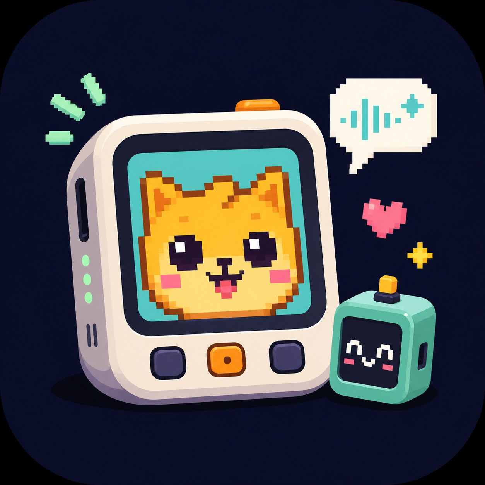
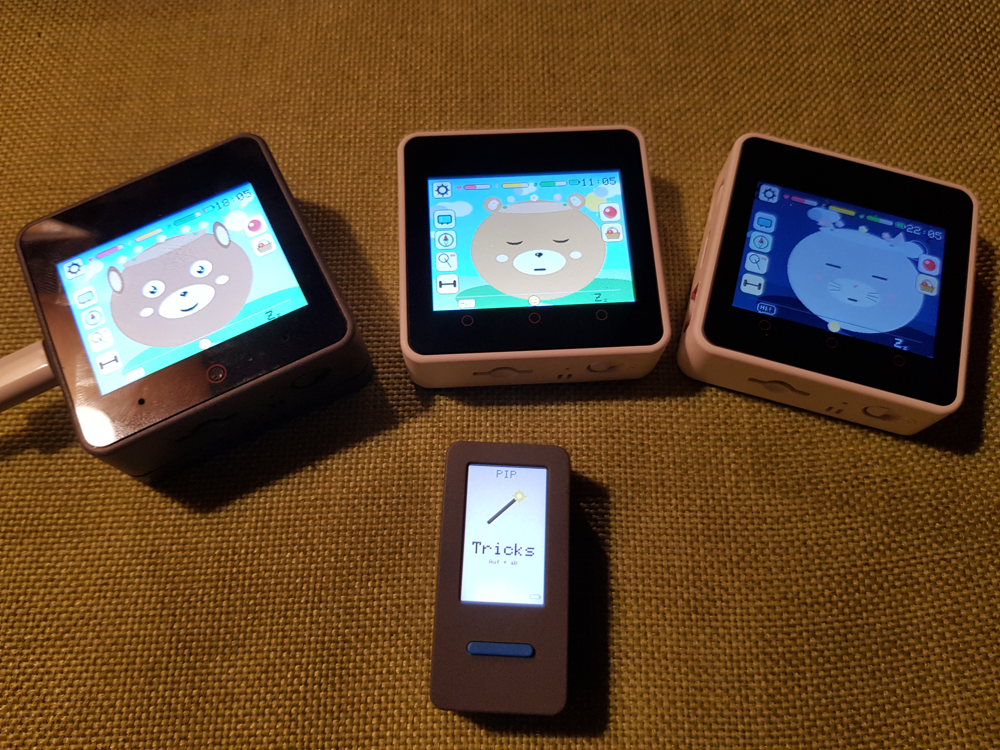
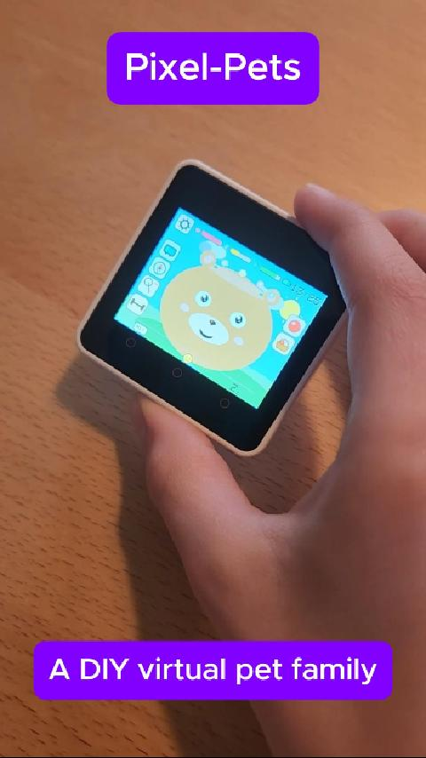
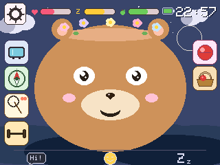
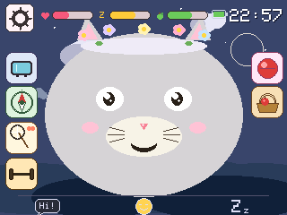
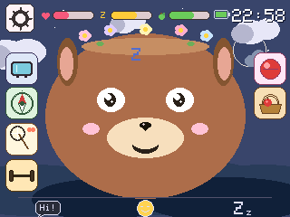
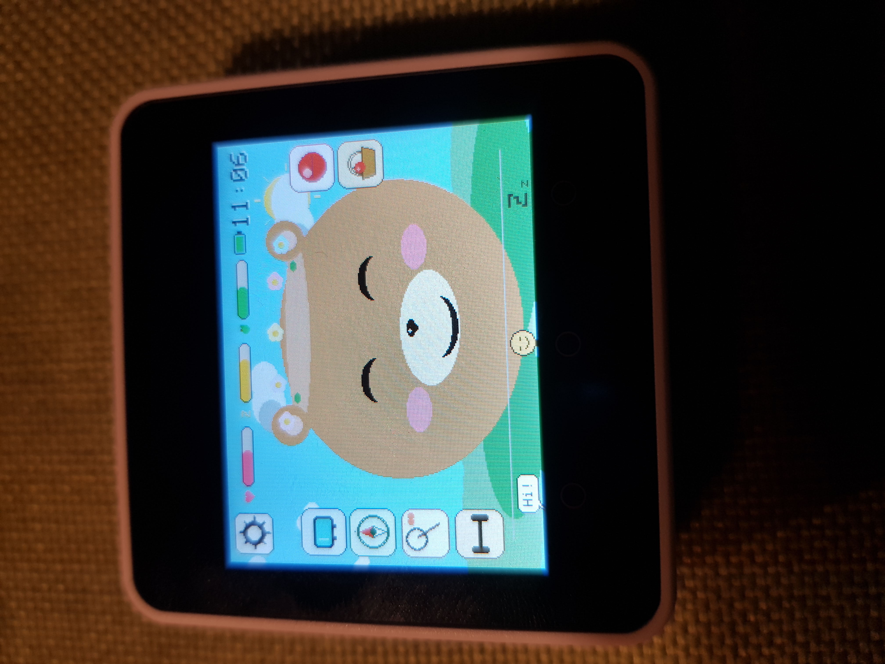

<p align="center">
  
</p>

# 🐾 Pixel Pets

<p align="center">
  <a href="https://github.com/marceld23/Pixel-Pets/stargazers">
    
  </a>
</p>

<p align="center">
  <a href="#highlights">Highlights</a> ·
  <a href="#fastest-start">Fastest start</a> ·
  <a href="#for-parents">For parents</a> ·
  <a href="#for-makers">For makers</a> ·
  <a href="#documentation">Documentation</a> ·
  <a href="#support-the-project">Support the project</a> ·
  <a href="#contributing">Contributing</a> ·
  <a href="#version-history">Version history</a>
</p>

A family of virtual pets on M5Stack hardware. **Three pet variants** — **Muffin** (CoreS3 + LLM), **Visu** (CoreS3 alone), **Goo-Goo** (Core2) — plus one optional **accessory**, **Pip** (M5StickC PLUS2), which acts as a pocket-sized companion device for any of the bigger pets. One source tree, five build envs (`cores3` / `visu` / `core2` / `pip` / `pip-s3`). Pet logic, animations, mini-games, ESP-NOW friends and weather/location are target-agnostic; voice and the front camera are CoreS3-only.

**Version 1.0.3** — small follow-up to 1.0.2 fixing a Pip-S3 deep-sleep wake bug + correcting the S3 download-mode docs for the K150 hardware. See [Version history](#version-history) at the bottom for the per-version scope.

> **👨‍👦 A note from the makers**
>
> Pixel Pets started as a Sunday afternoon between a dad and his 10-year-old son, Justus, sitting on the sofa together. Every line of firmware was co-authored with Claude (Anthropic) under our direction.
>
> Justus checks the GitHub star count on Sundays. If you think a 10-year-old shipping a kid-safe AI pet on real M5Stack hardware is cool, [**drop a ⭐**](https://github.com/marceld23/Pixel-Pets) and make his weekend. The full story is in [`CREDITS.md`](CREDITS.md).

<p align="center">
  <br>
  <em>The whole family on the desk: Muffin showing the dog pet, two Goo-Goos showing the bear and cat, with a Pip on the Tricks page in front.</em>
</p>

<p align="center">
  <a href="assets/video/demo-en.mp4">
    
  </a><br>
  <em>10 seconds with a Goo-Goo on the desk — click the cover to watch (1.5 MB MP4). German-captioned variant at <a href="assets/video/demo-de.mp4">demo-de.mp4</a>.</em>
</p>

## ⚡ 2-minute feature reel

<p align="center">
  <a href="https://www.youtube.com/shorts/jGS-yNJveYc">
    
  </a><br>
  <em>2 minutes in action — voice control on Muffin, gift exchange between two pets via ESP-NOW Friends mode, and a Pip wrist-flick treat throw. Click to watch on YouTube.</em>
</p>

## 🎥 Project Deep-Dive

<p align="center">
  <a href="https://youtu.be/2V9dgzdXCR8">
    
  </a><br>
  <em>A 7-minute deep dive into the project, safe hardware for kids, and how 10-year-old Justus built this with Claude AI. Also available <a href="https://youtu.be/iCOyaJQFdys">in German</a>.</em>
</p>

## Pick your pet animal

Each device renders the same set of animals — **Bear, Cat, Dog** — chosen on first boot (and changeable later in Settings). Real screenshots from a Goo-Goo (Core2):

| Bear | Cat | Dog |
|:---:|:---:|:---:|
|  |  |  |

<p align="center">
  <br>
  <em>Goo-Goo on a meadow scene — what the bear looks like through a phone camera.</em>
</p>

**Where to find Pixel Pets:**

- 🐻 [**Live landing page**](https://marceld23.github.io/Pixel-Pets/) — short intro, real-hardware video and an overview of all variants. Source under [`site/`](site/), deployed via GitHub Actions on every push.
- 🛠️ [**Build write-up on Hackster.io**](https://www.hackster.io/marcelduetscher/pixel-pets-an-ai-assisted-virtual-pet-family-for-m5stack-baa76c) — the assembly story, build photos and Q&A in the maker-community format.
- 💻 [**Source on GitHub**](https://github.com/marceld23/Pixel-Pets) — you're already here.

## Highlights

- **Three animals × three pet variants** — pick **Bear / Cat / Dog** on first boot (changeable later in Settings), running on **Muffin** (CoreS3 + LLM), **Visu** (CoreS3 alone) or **Goo-Goo** (Core2). Same source tree.
- **World-aware pet** — at boot the device looks up your **location** (IP geolocation via ip-api), pulls **real weather**, **sunrise / sunset times** and the **moon phase** from open-meteo, and adapts the scene to the actual time of day at your location: pale-blue **Morning** sky → clear **Day** sky → muted **Evening** dusk → dark **Night** with a crescent moon. The sun and clouds tint with the same phase. All cached in NVS so it survives reboots offline.
- **Battery-backed clock + NTP sync** — wall-clock time is synced once a day over Wi-Fi and persisted by the RTC in between, so the time-of-day rendering and the parental session limit work even with no network on a given day.
- **Voice control** *(Muffin only)* — wake word **"Muffin"**, offline **Whisper** speech-to-text + **Qwen3-0.6B** intent classifier running on the Module-LLM expansion. Plain sentences ("eat something", "let's dance", "turn on the radio") trigger matching actions. No cloud, no audio leaves the device.
- **Front camera + selfies** *(Muffin / Visu)* — proximity-wake when you walk past, photo button overlays the pet on a selfie, 5-slot LittleFS gallery with delete.
- **ESP-NOW Friends + Pip accessory** — two pets in range pair with a synchronised tap and exchange gifts / hearts / food / toys over ESP-NOW (no router needed). The optional **Pip** (M5StickC PLUS2) acts as a pocket-sized treat thrower: pick Apple / Carrot / Bone with BtnA, wrist-flick to throw, home pet eats it within ~200 ms.
- **Web radio** — WDR Die Maus (DE) / Fun Kids UK (EN) in the media menu, pet sways to the music; voice-triggerable on Muffin.
- **Mini-games + scenes** — squat / jump / yoga workouts, butterflies / mushrooms / surf / scorpion / asteroids / cross-the-street per scene, foraging for apple / berry / fish, five toys with boredom mechanics, scene travel between Bedroom / Meadow / Forest / Beach / City / Desert / Space.
- **Parent dashboard** — captive-portal Wi-Fi setup, optional **`<pet>-setup.local`** web server for live stats and remote-edit of the daily play-session limit (5–120 min). Session expiry triggers a 30-minute lockout that survives reboots.
- **Eleven moods + gestures** — Idle / Happy / Excited / Love / Sleepy / Sleeping / Sad / Startled / Laughing / Eating / Speaking, driven by happiness / energy / fullness needs. Touch zones (forehead / cheeks / mouth / ears), IMU-based petting / shake / stand reactions, somersault on circle drag, sing-and-applause when tilted upright.

See the [Version history](#version-history) for the full per-target breakdown.

## Targets

The three pets:

| Target | Board | Branding | Voice | Camera | Hard buttons | Display | Audio | Web radio |
|---|---|---|---|---|---|---|---|---|
| `cores3` | M5Stack CoreS3 + Module-LLM    | "Muffin"  | ✅ Wake word + Whisper + Qwen3 | ✅ | ❌ Touch strip | 320×240 | WAV | ✅ |
| `visu`   | M5Stack CoreS3 without module  | "Visu"    | ❌ | ✅ | ❌ Touch strip | 320×240 | WAV | ✅ |
| `core2`  | M5Stack Core2                  | "Goo-Goo" | ❌ | ❌ | ✅ BtnA/B/C | 320×240 | WAV | ✅ |

The accessory:

| Target | Board | Role | Display | Audio |
|---|---|---|---|---|
| `pip`    | M5StickC PLUS2 (ESP32 PICO)   | Pocket-sized companion to a bigger pet — sends treats and gestures over ESP-NOW. Doubles as a tiny pet face when out of range. | 135×240 | Buzzer |
| `pip-s3` | M5StickC PLUS2 (S3 revision)  | Same role, ESP32-S3 board variant. | 135×240 | Buzzer |

## Hardware shopping list

Pick **one pet** plus optionally **a Pip** as a pocket-sized accessory. Direct links to the M5Stack official store; all USB-C, no soldering, no breadboard.

### Pets — pick one

| Pet | Required parts | M5Stack store links |
|---|---|---|
| **Muffin** | M5Stack CoreS3 + **M5Stack Module LLM (AX630C)** + **Battery Module 13.2** (1500 mAh — separate purchase, not bundled with the LLM module). | [CoreS3](https://shop.m5stack.com/products/m5stack-cores3-esp32s3-iotdevelopment-kit) · [Module LLM (AX630C)](https://shop.m5stack.com/products/m5stack-llm-large-language-model-module-kit-ax630c) · [Battery Module 13.2](https://shop.m5stack.com/products/battery-module-13-2-1500mah) |
| **Visu** | M5Stack CoreS3 + **M5GO Battery Bottom3** (500 mAh, official CoreS3 accessory). | [CoreS3](https://shop.m5stack.com/products/m5stack-cores3-esp32s3-iotdevelopment-kit) · [Battery Bottom3](https://shop.m5stack.com/products/m5go-battery-bottom3-for-cores3-only) |
| **Goo-Goo** | M5Stack Core2 (built-in 500 mAh battery, no extra parts). | [Core2](https://shop.m5stack.com/products/m5stack-core2-esp32-iot-development-kit-v1-1) |

### Pip — optional pocket accessory

| | |
|---|---|
| **Pip** | M5StickC PLUS2 (built-in 200 mAh battery, no extra parts). [StickC PLUS2](https://shop.m5stack.com/products/m5stickc-plus2-esp32-mini-iot-development-kit) |

Pip is **not** a fourth pet. It's a tiny ESP-NOW remote that pairs with any of the three home pets above. Display shows the next treat the kid will throw (Apple / Carrot / Bone, BtnA cycles); a quick wrist-flick fires an ESP-NOW broadcast and within ~200 ms the home pet eats the treat (`Face::Eating` + Eat sound + Apple/Heart floats + happiness/fullness boost).

Pet-mode owners enable reception via **Settings → Pip mode** (page 4). The toggle is off by default — the always-on listener costs ~20 % battery runtime on the bigger pet, so opt-in is honest. Pip itself stays radio-off until each shake (sender powers up the radio for ~150 ms per throw), so its 200 mAh battery is essentially unaffected.

The treat-thrower flow is shipped end-to-end and verified on hardware. See [`src/pip_link.h`](src/pip_link.h) (listener API), [`src/pip/pip_link_send.h`](src/pip/pip_link_send.h) (Pip-side sender). Other companion ideas (egg/hatchling, pet-mail, remote shutter) are sketched in [`docs/concept.md`](docs/concept.md) but not on the immediate roadmap — Pip is treated as feature-complete for now.

Web radio (in the media menu) plays **WDR Die Maus** in German and **Fun Kids UK** in English — no negative side effects, with note-symbol animation and body sway. On cores3 it can also be triggered by voice command ("turn on the radio").

On Muffin and Visu additionally: **Photo** and **Gallery** in the media menu. Photo opens the front camera with the pet overlaid in the lower-left corner (pet selfie), tap = capture. Gallery walks through the last five photos with left/right-tap navigation. Both reward happiness without negative effects.

## For parents

Pixel Pets is a DIY maker project, but it is designed with families in mind.

- No cloud account is required for the core pet experience.
- No tracking or subscription model is built into the firmware.
- The code is open source and can be inspected, changed and flashed yourself.
- A configurable parental session limit is included.
- The project works best as a shared maker activity: assemble, flash, test, name the pet and invent new interactions together.

Pixel Pets is not a certified commercial toy. Adult setup and supervision are recommended.

## For makers

Pixel Pets is also a compact playground for embedded interaction design:

- ESP32 / M5Stack firmware with PlatformIO
- one source tree with multiple hardware targets
- shared pet state and rendering logic
- touch, buttons, IMU, camera and audio integration
- ESP-NOW communication between devices
- optional offline voice pipeline on CoreS3 + Module-LLM
- world data via WiFi, cached locally
- native unit tests for pure logic modules

Good places to start hacking are new scenes, mini-games, face animations, sounds, Pip interactions or new pet personalities.

## Fastest start

Sorted from easiest to hardest setup. Each row links to a self-contained per-pet guide that covers everything (USB driver, env, flashing quirks, gotchas).

💾 **Don't want to install PlatformIO?** Every [GitHub release](https://github.com/marceld23/Pixel-Pets/releases/latest) ships pre-built `pixel-pets-vX.Y.Z-<pet>.bin` files — single-file flash images at offset `0x0`. Use [M5Burner](https://docs.m5stack.com/en/uiflow/m5burner/intro) ("Custom Firmware" → upload .bin) or `esptool.py --chip <esp32|esp32s3> write_flash 0x0 pixel-pets-…bin`. Muffin's voice features still need the Module-LLM Linux setup from [`docs/setup-muffin.md`](docs/setup-muffin.md) on top of the binary.

| Pet | Hardware | Difficulty | Setup guide |
|---|---|---|---|
| **Goo-Goo** | M5Stack Core2 | 🟢 Easiest — plug, flash, run | [`docs/setup-goo-goo.md`](docs/setup-goo-goo.md) |
| **Visu** | M5Stack CoreS3 | 🟢 Easy — same idea on CoreS3 | [`docs/setup-visu.md`](docs/setup-visu.md) |
| **Pip** | M5StickC PLUS2 (ESP32-PICO or S3 rev.) | 🟡 Medium — the S3 revision needs a manual download-mode procedure | [`docs/setup-pip.md`](docs/setup-pip.md) |
| **Muffin** | M5Stack CoreS3 + Module-LLM | 🔴 Advanced — extra hardware + ADB / Linux setup on the LLM module (Whisper, Qwen3, gotchas) | [`docs/setup-muffin.md`](docs/setup-muffin.md) |

If you're new to the project, start with **Goo-Goo** (if you have a Core2) or **Visu** (if you have a CoreS3) — both are roughly an hour from unbox to running pet. Muffin adds another evening for the Module-LLM setup. Pip is optional and only useful once a bigger home pet is running.

## Build & flash

```bash
pio run -e cores3                              # Muffin (CoreS3 + LLM, default)
pio run -e cores3 -t upload                    # Muffin build + flash
pio run -e visu                                # Visu (CoreS3 alone)
pio run -e core2                               # Goo-Goo (Core2)
pio run -e pip                                 # Pip accessory (StickC PLUS2 PICO)
pio run -e pip-s3                              # Pip accessory (StickC PLUS2 S3)
pio run -e cores3 -e visu -e core2 -e pip-s3   # build all
```

For per-pet setup details (USB driver, env, flashing quirks, Module-LLM workflow), see the [Fastest start](#fastest-start) table above — every pet has its own dedicated guide under [`docs/setup-*.md`](docs/).

## Repository layout

```
src/
  target_caps.h            ← TARGET_HAS_LLM / HAS_CAMERA / HAS_HARD_BUTTONS / ...
  main.cpp                 ← orchestrator (setup + loop) for the big pets
  main_pip.cpp             ← Pip orchestrator (replaces main.cpp on the pip env)
  face.{h,cpp}             ← renderer (PetView-driven)
  pet_state.{h,cpp}        ← pet runtime: RTC, persistence, gaze, touch zones
  needs_logic.{h,cpp}      ← pure happiness/energy/fullness logic (native-testable)
  voice_pipeline.{h,cpp}   ← wake / VAD / Whisper / Qwen3 over UART (HAS_LLM only)
  face_detect.{h,cpp}      ← front-camera face detection + JPEG capture (HAS_CAMERA only)
  photo_store.{h,cpp}      ← LittleFS-backed selfie storage (HAS_CAMERA only)
  webradio.{h,cpp}         ← MP3 stream decoder (HAS_WIFI only)
  pip_link.{h,cpp}         ← ESP-NOW listener for treats/tricks from a paired Pip
  net.{h,cpp}              ← WiFi, captive portal, NTP, ESP-NOW friends, parent server
  world.{h,cpp}            ← IP geolocation + open-meteo + moon phase
  i18n.{h,cpp}             ← string table (DE + EN, switchable at runtime)
  wifi_config.h            ← compile-time WiFi credential defaults
  screenshot.{h,cpp}       ← canvas dumper (SCREENSHOT_MODE only, *-shots envs)
  sounds/                  ← embedded WAV headers (xxd -i)
  pip/                     ← StickC Plus 2-only renderer + tone-based sound engine

docs/
  concept.md               ← gameplay & high-level design
  architecture.md          ← software architecture (modules, build flow, state)
  hardware.md              ← per-pet setup index + capability matrix
  setup-goo-goo.md         ← Core2 (Goo-Goo) setup guide — easiest
  setup-visu.md            ← CoreS3 (Visu) setup guide — easy
  setup-pip.md             ← StickC PLUS2 (Pip) setup guide — medium, S3 download-mode
  setup-muffin.md          ← CoreS3 + Module-LLM (Muffin) setup guide — advanced; Module-LLM ADB workflow + Qwen3 gotchas
  sound_assets.md          ← WAV sample spec and trigger map

site/                      ← GitHub Pages landing page (index.html + scripts + assets)
assets/                    ← master media: logo.jpg, photos/, sounds/, video/
screenshots/               ← real-hardware Bear / Cat / Dog captures used in this README
tools/                     ← Python helpers (uv-managed): shot.py, listen.py, extract_screenshots.py
test/test_needs_logic/     ← Unity tests for the pure-logic needs module (`pio test -e native`)
pkgs/                      ← Module-LLM .deb packages (audio / framework / models / services; .debs gitignored)
.github/workflows/         ← ci.yml (matrix builds + native tests), pages.yml (Pages deploy)

platformio.ini             ← [env:cores3] + [env:core2] + [env:visu] + [env:pip] + [env:pip-s3] + *-shots variants
partitions_cores3_16MB.csv ← partition table for CoreS3 / Visu (incl. LittleFS)
partitions_core2_16MB.csv  ← partition table for Core2
partitions_pip_8MB.csv     ← partition table for StickC Plus 2
CREDITS.md                 ← father-and-son project credits
LICENSE                    ← MIT
```

## Documentation

- [`docs/concept.md`](docs/concept.md) — how the pet ticks: needs, input (touch / IMU / hard buttons / voice / camera), world, mini-games, parental session limit, persistence.
- [`docs/architecture.md`](docs/architecture.md) — software architecture: module overview, build-target system, state model, render pipeline.
- [`docs/hardware.md`](docs/hardware.md) — overview index with the build-target capability matrix; links to the per-pet setup guides:
  - [`docs/setup-goo-goo.md`](docs/setup-goo-goo.md) — Core2 (🟢 easiest)
  - [`docs/setup-visu.md`](docs/setup-visu.md) — CoreS3 (🟢 easy)
  - [`docs/setup-pip.md`](docs/setup-pip.md) — StickC PLUS2 (🟡 medium, S3 download-mode dance)
  - [`docs/setup-muffin.md`](docs/setup-muffin.md) — CoreS3 + Module-LLM (🔴 advanced, includes the ADB workflow + Qwen3 gotchas)
- [`docs/sound_assets.md`](docs/sound_assets.md) — WAV spec, sample list, trigger map (Pip uses tone sequences instead).

## Continuous integration

GitHub Actions in [`.github/workflows/ci.yml`](.github/workflows/ci.yml):

- **Matrix build** for all four firmware targets (`cores3` / `core2` / `visu` / `pip`). Fails any PR that breaks a build.
- **Native unit tests** (`pio test -e native`) for the pure-logic modules in [`src/needs_logic.cpp`](src/needs_logic.cpp). Tests live under [`test/test_needs_logic/`](test/test_needs_logic/) and use Unity. Run locally with `pio test -e native` (Linux/macOS, or Windows with MinGW gcc on PATH).

## Screenshots for the docs

The firmware has a built-in canvas dumper, gated behind the dedicated **`*-shots` envs** in [`platformio.ini`](platformio.ini) so it never lands in production builds. Flash one of `cores3-shots` / `visu-shots` / `core2-shots`, navigate to the screen you want to capture and **hold the PWR button ≥ 2 s** — the canvas is dumped over Serial as base64 RGB565. The host-side decoder in [`tools/extract_screenshots.py`](tools/extract_screenshots.py) turns it into PNGs.

Python tooling is managed with [`uv`](https://docs.astral.sh/uv/) — see [`tools/README.md`](tools/README.md) for the full workflow.

## Authors

A father-and-son project: **Justus Dütscher** (10) — ideas, design decisions, tireless field-testing — and **Marcel Dütscher** (Papa) — translating Justus's ideas for the AI doing the actual coding, plus the bits of technical know-how that don't fit on a kid's whiteboard. The first beta was finished on a Sunday afternoon; the boring polish was Papa's evening work.

Every line of firmware was written by AI assistants — primarily **Claude (Anthropic)** — under our direction. `git log --format="%an %ae"` shows which model touched which commit.

See [`CREDITS.md`](CREDITS.md) for the full story, and the in-app credits screen via Settings → Credits.

## Support the project

Pixel Pets is a family project — not a startup, no roadmap, no metrics dashboard. But we'd love for it to find more kids and dads who want to tinker. The cheapest things that genuinely help:

- **Drop a ⭐ on the repo.** It's the cheapest signal that something resonated, and it really does help the project surface to other curious people scrolling GitHub. Justus checks the count on Sundays.
- **Or leave a "respect" on Hackster.io** — same idea, different community: project page at [hackster.io/marcelduetscher/pixel-pets-…](https://www.hackster.io/marcelduetscher/pixel-pets-an-ai-assisted-virtual-pet-family-for-m5stack-baa76c).
- **Try it with a kid you know.** That's actually the most valuable feedback we get — what works, what confuses, what's missing for a 7-year-old vs a 10-year-old.

## Contributing

We'd love your help — code, ideas, bug reports, translations, a new sound, a face animation, an extra language string, a photo of a kid trying it out. All welcome. No CLA, no contributor agreement, no Slack to join. Just GitHub.

- 📘 [**Contributing guide**](CONTRIBUTING.md) — setup, conventions, how to get a PR merged. Good first contributions: a new sound, a new scene, a face animation, a mini-game, an extra language string. [`docs/architecture.md`](docs/architecture.md) explains where things live.
- 💬 [**Discussions**](https://github.com/marceld23/Pixel-Pets/discussions) — questions, share what you built, show-and-tell.
- 🐛 [**Issues**](https://github.com/marceld23/Pixel-Pets/issues) — bug reports, feature requests, "Justus has Strong Opinions™ on what feels right; pitch yours".

## Version history

### 1.0.3 — May 2026

Small follow-up to 1.0.2. One firmware fix that closes a regression introduced in 1.0.2, and a docs correction so the next person doesn't lose hours to the same wrong setup steps.

**Pip-S3 deep sleep now actually wakes back up:**

- 1.0.2's "real deep sleep after 3 min idle" plus the USB-PHY detach were both correct, but together they exposed a third bug: `M5Unified::Power_Class::_setupBoard()` has no case for `board_M5StickS3` in the `_wakeupPin` switch, so `_wakeupPin` stayed at `255` (`GPIO_NUM_MAX`). `M5.Power.deepSleep(0, true)` then skipped its `esp_sleep_enable_ext0/1_wakeup()` call, the chip entered deep sleep with **no wakeup source at all**, and the only way back was a PMIC power-cycle (long-press to force-off → short-press to cold-boot)
- 1.0.3 manually configures BtnA (GPIO11, RTC-capable on ESP32-S3) as an `ext1` active-low wakeup source before handing off to `M5.Power.deepSleep()`. Same one-line workaround applied in the brownout-protection boot path so a low-battery sleep doesn't strand the device either. After the fix: a short BtnA press wakes the Stick S3 cleanly from deep sleep, just like the StickC Plus 2 variant has worked all along
- The StickC Plus 2 path (`pip` env, ESP32-PICO) is unchanged — its wakeup pin (GPIO35 = power button) was already correctly mapped in M5Unified

**Pip setup docs corrected for the M5StickS3 (K150) hardware:**

- The old `docs/setup-pip.md` "S3 revision" procedure was: "hold BtnA, press the side reset button for ~2 s." That's the **original PLUS2 S3 revision** procedure, where BtnA happens to be wired in parallel with GPIO0 (the strap pin) and there's a separate hardware reset button on the side. On the **newer M5StickS3 (SKU K150)** — which is what most people now buy — BtnA is GPIO11 (not GPIO0), and there is no separate reset button (only the PM1 PMIC power button). The published procedure simply could not trigger download mode on K150 hardware
- The setup doc now splits the S3 path into two clearly-labelled variants: PLUS2 S3 keeps the BtnA + reset procedure, K150 gets a **Hat2-Bus G0 ↔ GND bridge** procedure with a PMIC cold-boot trigger. Includes the full 16-pin Hat2-Bus pinout table (G0 on pin 4, GND on pin 1, plus the UART pins for the recovery path below)
- Documented the slow ~1 Hz green LED blink as the visual confirmation that the chip is in ROM bootloader — no need to guess from "display is dark, did it work?"
- Added a **UART recovery-flash recipe** for the case where the Stick S3's USB-C connector has developed loose D+/D- contacts (power pins still work, hence LED + charging, but USB enumeration is dead even on a fresh OS install). Wire a USB-TTL adapter to Hat2-Bus G43 (TX) / G44 (RX) / GND, enter download mode the usual way, and flash through the adapter with `esptool --before no_reset`. Confirmed working as the only path back for one user's stick after the USB-C port wore out across many cold-boot cycles

### 1.0.2 — May 2026

Small follow-up to 1.0.1. Two real fixes plus a homepage tweak.

**Motion-gesture reliability — Spielen / Regen / Singen now clearly distinguishable:**

- Lowered the magnitude threshold for both shake gestures (1.0 g → 0.7 g for the play-shake and the rain-shower vertical shake). Reproducibly hard for kid-sized wrist motions to reach 1 g; 0.7 g triggers cleanly without false-firing on accidental jostles
- Vertical-shake dominance ratio relaxed (1.0 → 0.6) so realistic up-down hand motions, which always carry some sideways jitter, qualify for "rain". Required vertical peaks dropped from 2 to 1 — one decisive down-flick is enough; users intuitively flick once for "shower"
- Singing gesture redesigned: was an "upright + tilt-left + tilt-right rising-edge sequence" that broke whenever the pet was already slightly tilted at sequence start (the rising edge never fired). Now it's "**heave-up + tilt-left + tilt-right**": the user must transition the pet from low (gy<0.4) to upright (gy>0.7) within 800 ms, then complete the L+R tilt within 5 s. The heave guarantees gx ≈ 0 at sequence start so the rising edge fires reliably; a pet just sitting on the desk doesn't trigger because there's no fresh transition
- Help-page 8 updated in DE + EN: "Hochheben, links + rechts kippen" / "Lift it up, tilt left + right"

**Pip-S3 robust USB-PHY detach before deep sleep:**

- 1.0.1's `Serial.flush()` + `Serial.end()` + 100 ms grace turned out not to be aggressive enough on every M5-Stick variant — one tested device still disappeared from the host after deep sleep, and only the 60-second-unplug recovery brought it back
- 1.0.2 explicitly drives GPIO19 / GPIO20 (the D- / D+ pins on the ESP32-S3) to input + pull-mode floating before `esp_deep_sleep_start()`. This collapses the 1.5 kΩ D+ pull-up so the host sees an unambiguous detach instead of a frozen-but-attached device. Grace bumped 100 → 200 ms because Windows sometimes doesn't register the detach in under 200 ms
- Plus: `M5.Power.isCharging()` is now polled up to 8× with 50 ms gaps at boot. The PMIC's charging-detect isn't stable for the first few ms after power-up — reading it once immediately could falsely return `false`, sending the brownout-protection branch straight into deep sleep with USB plugged in (and looking like a "won't boot" device to the user)

**Site:**

- New 2-minute YouTube-Short feature reel section between the hero demo and the deep-dive embed (covers voice control on Muffin, ESP-NOW Friends gift exchange, and a Pip wrist-flick treat throw — all on real hardware). Caption translated DE / EN, `iframe` aspect-ratio 9:16 to match the vertical Short format

### 1.0.1 — May 2026

Reliability release — same features as 1.0.0, but the rough edges that surfaced in the days after launch are fixed. No protocol changes; existing pets keep their NVS state when upgraded.

**Friends mode — now actually reliable across all pet pairs:**

- Switched the ESP-NOW PHY from LR to standard 802.11 B/G/N. The LR mode had reproducible interop problems between ESP32 (Goo-Goo) and ESP32-S3 (Muffin / Visu) — packets sent in LR didn't decode on the other side
- Pets now run in `WIFI_AP_STA` instead of pure `WIFI_STA` — the ESP32-S3 stack silently dropped most ESP-NOW broadcast frames in disconnected-STA mode
- Once the partner's MAC is known, gift packets switch from broadcast to unicast. 802.11 unicast has ACK + retry at the MAC layer; broadcast was fire-and-forget and the CoreS3 RX path frequently lost it
- Reach-back Ready in the Sending state — the faster tapper used to go silent the moment they matched, leaving the slower partner stuck on "Waiting for friend" until the 60 s timeout
- Smaller initial bursts (1 packet instead of 3-4) and jittered re-broadcast intervals — avoids the "two pets burst into each other" RF collision that froze the rendezvous

**Web radio — stutter-free, knacks-free, and tap-resilient:**

- Audio decoder now runs on its own FreeRTOS task pinned to core 1, separate from the main loop. Pet animations / touch sampling / friends ticks no longer starve the MP3 decoder mid-frame
- `WiFi.setSleep(false)` while streaming — keeps the radio listening continuously instead of waking only on DTIM beacons
- Display sleep no longer kills the audio: the main loop stays at 1 ms cadence as long as media is active
- Pet sound effects (greet / tickle / eat …) are suppressed during radio playback so they don't fight the audio library for the I2S bus — fixes the audible knacks
- Volume slider now actually applies to the stream, live: was hardcoded to ~80 %
- Listen-lock: while the radio plays, the pet ignores every interaction except a tap on the Media button (which still toggles the radio off). Hard buttons A / B / C are gated too. Touching the pet no longer yanks it into a sound-effect animation that stops the music
- "Brauche WLAN" overlay when the radio is tapped without any saved WiFi credentials — bounces back to the chooser instead of silently timing out after 10 s

**Pip — no more "bricked-looking" Stick S3:**

- The Pip-S3 firmware now explicitly tears down the USB-CDC stack before deep sleep. Without this, the ESP32-S3's D+ pull-up stayed asserted across deep sleep — the host never saw a detach, and on the next reset the device was *invisible* (no COM port, no `VID 303A` enumeration). Recovery used to require a 60 s unplug or holding the reset pinhole; that's no longer needed
- Pip's treat / wand sender is now on B/G/N + AP_STA to match the home-pet receiver after the Friends-mode PHY switch above. Without this fix Pip's announcements wouldn't reach Goo-Goo / Muffin / Visu

**Site / CI / docs:**

- Site supports `?lang=de` / `?lang=en` URL overrides for shareable language-pinned links
- README split into separate Support and Contributing sections, Star-History chart added
- Module-LLM setup script extracted from the README into `scripts/setup-module-llm.sh` with a CI lint
- Release workflow has a manual dry-run mode for testing before tagging
- Per-env firmware artifacts (`firmware-cores3` / `firmware-core2` / `firmware-visu` / `firmware-pip`) uploaded on every CI run, downloadable for 14 days from the Actions page
- Dependabot, typos, CodeQL, lychee + `pio check` CI added; CodeQL findings cleared

**Smaller bug fixes:**

- WiFi-setup screen now shows the correct AP name per target (`muffin-setup` / `goo-goo-setup` / `visu-setup`) instead of always saying `muffin-setup`
- Web radio plays sound on its second start in the same session (was silent because `M5.Speaker.begin()` had grabbed the I2S bus back)

### 1.0.0 — May 2026

First stable release. Three pet variants and one accessory, all verified end-to-end on hardware.

**The pets** (Muffin / Visu / Goo-Goo):

- 11 moods driven by happiness / energy / fullness needs
- Touch zones (forehead / cheeks / eyes / mouth) + IMU-based petting / shake / stand reactions
- Gestures: somersault on circle drag, wobble on two-finger pull, snuggle on long hold
- Mini-games per scene (squat / jump / yoga / butterflies / mushrooms / surf / scorpion / asteroids / cross-the-street), foraging for apple/berry/fish, toy play with five toys + boredom, scene travel between Bedroom / Meadow / Forest / Beach / City / Desert / Space
- Singing + applause: tilt sequence triggers the pet to sing, mic listens for a loud peak afterwards
- Real weather + sunrise/sunset (open-meteo) and local moon-phase, IP-based location lookup (ip-api), all cached in NVS
- Egg-timer screen with vibration + Goo-Goo cue when it expires
- Parental session limit (5–120 min, configurable via parent web server) with a 30-minute lockout after expiry
- ESP-NOW Friends mode between any two home pets — rendezvous handshake, gift exchange, LR PHY for asymmetric-RF reliability

**Muffin only** (CoreS3 + Module-LLM):

- Wake word "Muffin" + on-device speech recognition (Whisper) + Qwen3-0.6B intent classifier
- Whisper-first bypass for ~80 % of commands (sub-second latency, no LLM round-trip)
- Voice-triggerable actions (eat, sleep, dance, radio …)
- TTS / wake-WAV side effects neutralised on the LLM module

**Muffin / Visu** (CoreS3 with front camera):

- Front camera + face / proximity detection — pet greets you when you walk past
- Photo + 5-slot gallery (LittleFS), pet-overlay selfies

**Goo-Goo / Visu / Muffin** (everything but Pip):

- Web radio (WDR Die Maus / Fun Kids UK), pet sways to the music
- Captive-portal WiFi setup
- Optional parent web server (mDNS `<pet>-setup.local`) for stats + session-limit edits

**The accessory** (Pip — M5StickC PLUS2):

- Pocket companion that pairs with any of the three home pets via ESP-NOW
- Five-page menu (BtnA cycles): "Wähle aus" (safe-carry mode, no shake response) → Apple → Carrot → Bone → Tricks
- Treat thrower: wrist-flick fires a 3-packet broadcast, home pet eats it within ~200 ms
- Tricks: peak-counted gesture → home pet visibly hops N times in a row (giggle sound + heart per landing)
- First-run language picker (DE / EN flags only, no text)
- Long-press BtnA = sleep; auto-sleep after 60 s idle; sleep-click regression on the buzzer fixed

**Other lanes that grew along the way:**

- GitHub Pages site rebuilt around "three pets + one accessory" framing, click-and-poke browser pet, hardware shopping list
- CI matrix builds all 5 envs on every push; native unit tests for the pure-logic needs module

## License

[MIT License](LICENSE) — open source, free to use, modify and redistribute.

Note: the web radio feature links against [`schreibfaul1/ESP32-audioI2S`](https://github.com/schreibfaul1/ESP32-audioI2S), which is GPL v3.0. Binaries built from the `cores3` / `core2` / `visu` envs therefore inherit GPL v3.0 obligations when redistributed. The `pip` env doesn't link the audio library and stays MIT all the way through. Source code in this repository is MIT regardless of which env you build. See [`LICENSE`](LICENSE) for the full third-party-licenses block.

## Star History

<a href="https://www.star-history.com/?repos=marceld23%2FPixel-Pets&type=date&legend=top-left">
 <picture>
   <source media="(prefers-color-scheme: dark)" srcset="https://api.star-history.com/chart?repos=marceld23/Pixel-Pets&type=date&theme=dark&legend=top-left" />
   <source media="(prefers-color-scheme: light)" srcset="https://api.star-history.com/chart?repos=marceld23/Pixel-Pets&type=date&legend=top-left" />
   
 </picture>
</a>
